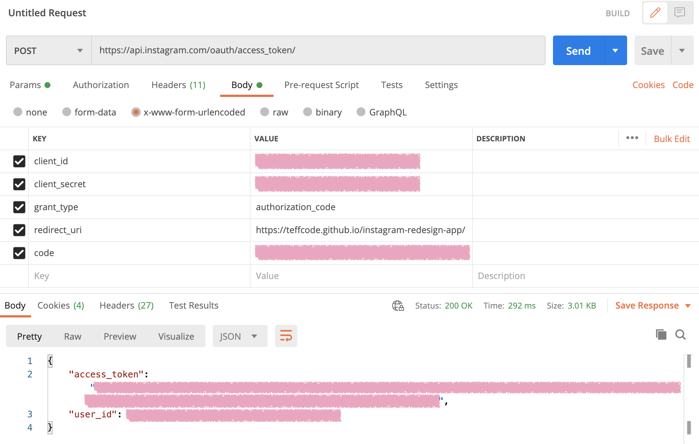
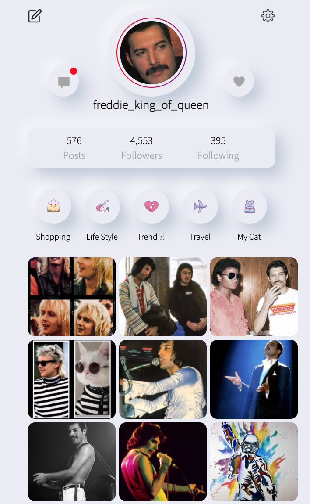

# Instagram rediseñado.

Se usa el token de usario de Instagram de corta duración para hacer consultas sobre un perfil de la API de instagram.

* Este se consigue en [Facebook for Developers](https://developers.facebook.com)
    * En el panel se agrega la configuración básica de Instagram. Creando una nueva app.
    * En los espacios de URI para redireccionamento de OAuth válidos se agrega la URL de la página creada, así como en la URL de devolución de llamada para autorización cancelada, URL de devolución de llamada de solicitud de eliminación de datos y se omite la revisión de APPs.
    * Se agrega un usuario de prueba de Instagram, en la pestaña de Roles / Roles -> Evaluadores de Instagram. Aceptando desde Instagram en la parte de Editar perfil / Aplicaciones y sitios web / Invitaciones de prueba.
    * Se autentica el usuario de prueba escribiendo en el área de URL
 ```
https://api.instagram.com/oauth/authorize
?client_id={app-id}
&redirect_uri={redirect-uri}
&scope=user_profile,user_media
&response_type=code
```
En donde {app-id} es el número de identificador del app de Instagram que se encuentra en la visualización básica de Instagram; y el {redirect-uri} es la página que creamos.
Al dar clic se abre una ventana para autorizar el acceso a Instagram y a los datos de la cuenta, regresando una URL con un código el cual tenemos que copiar, sin el # incluido al final.

* En Postman se realiza una petición POST a la [API de Instagram](https://api.instagram.com/oauth/access_token), se usa con Body y se agregan los parámetros de:
    * client_id que es el identificador de la app de Instagram,
    * client_secret, la clave secreta de la app de Instagram,
    * grant_type, authorization_code
    * redirect_uri, la URL de nuestra página
    * code, el código que copiamos en el paso previo.



## Nota aclaratoria. Los datos duran aproximadamente una hora en la página.

Con esto obtenemos el "access token" que es el que usaremos en la variable de JavaScript y con la que se hace el consumo de la API.
Se rediseñó con el neomorfismo

Resultando esto:



El deploy se encuentra en [Freddie Instagram](https://kuraitsukino.github.io/instagram-redesign-app/)

## 🛠 Construido con 🛠

* HTML
* JavaScript
* CSS
* GitHub Pages - Despliegue

## ✒️ Autora ✒️

[Kurai Tsukino](https://github.com/KuraiTsukino) aka Sandra Mena

Con la ayuda del tutorial de [Estefany Aguilar](https://platzi.com/blog/rediseno-instagram-api-animaciones/)
